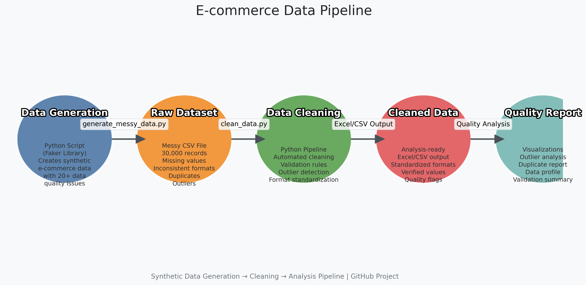

# Overview

This project showcases robust **data generation** and **cleaning** skills by creating a realistic **synthetic e-commerce dataset** with intentional **data quality issues**, then demonstrating professional-grade **cleaning techniques** to prepare it for analysis. The solution highlights:

**Synthetic Data Generation**: Creating realistic but messy datasets for testing

**Data Cleaning Pipeline**: Comprehensive cleaning of common real-world data issues

**Automated Quality Checks**: Outlier detection and duplicate identification

**Reproducible Workflow**: Complete pipeline from data creation to analysis-ready output

## Data Pipeline Overview

**Figure 1:** End-to-end data pipeline showing the synthetic data generation, cleaning process, and analysis workflow

# Key Features

🧪 Synthetic Data Generation
Creates realistic e-commerce datasets with 30k+ records
Introduces 20+ types of data quality issues including:
Inconsistent formatting (names, dates, phone numbers)
Missing values and duplicates
Invalid entries and outliers
Mixed data types
Multiple date formats
Customizable parameters for data volume and messiness

# 🧹 Intelligent Data Cleaning
Comprehensive cleaning pipeline:
Missing value handling with verification flags
Name standardization and capitalization
Email validation and correction
Phone number formatting
Date standardization (ISO 8601)
Price and quantity normalization
Automated quality checks:
Outlier detection with statistical reporting
Duplicate identification with explanation
Data validation at each processing step
Excel output with visual verification indicators

# 📊 Analysis-Ready Output
Clean, structured dataset ready for analysis
Visual reports on data quality issues
Flagged records requiring manual verification
Multiple output formats (Excel with formatting, CSV)
Getting Started
Prerequisites
Python 3.8+

## Required packages: pandas, numpy, faker, matplotlib, seaborn, xlsxwriter

# Clone the repository
git clone https://github.com/ssmujtaba/ecommerce-data-cleaner.git

# Navigate to project directory
cd ecommerce-data-cleaner

# Install required packages
pip install -r requirements.txt

# 1. Usage
python generate_messy_data.py
Generates messy_ecommerce_data.csv with 30,000 records of messy e-commerce data

# 2. Clean the Dataset
python clean_data.py

# Customization
## Adapting to Your Dataset
The cleaning script is designed with modular functions that can be adapted to any dataset:
## 1. Missing Value Handling (clean_data.py: Lines 20-40)
def handle_missing_names(df):
    """Customizable missing name handling"""
    # ... your implementation ...
    return df
## 2. Column-Specific Cleaning (clean_data.py: Lines 42-300)
def generic_cleaner(column, cleaning_function):
    """Apply cleaning function to any column"""
    df[column] = df[column].apply(cleaning_function)
    return df

## 3. Quality Control (clean_data.py: Lines 302-332)
def quality_report(df):
    """Generate customizable data quality report"""
    # ... your quality checks ...
    return report

# Configuration Options
## Customize the scripts through parameters:
# In generate_messy_data.py
num_rows = 50000  # Increase dataset size
start_date = datetime(2018, 1, 1)  # Extend date range
messiness_level = 0.7  # 0-1 scale (1 = extremely messy)

# In clean_data.py
OUTPUT_FORMAT = 'excel'  # 'csv' or 'excel'
VERIFICATION_COLOR = '#FF9999'  # Custom highlight color
OUTLIER_THRESHOLD = 2.0  # IQR multiplier (default 1.5)

# Project Structure
├── generate_messy_data.py     # Synthetic data generator
├── clean_data.py              # Data cleaning pipeline
├── requirements.txt           # Dependencies
├── messy_ecommerce_data.csv   # Generated messy data
├── cleaned_ecommerce_data.xlsx # Cleaned output
├── outlier_reports/           # Generated quality visuals
│   ├── price_distribution.png
│   ├── quantity_distribution.png
│   └── value_distribution.png
└── README.md                  # This documentation

# Key Data Cleaning Techniques Implemented
## 1. Intelligent Missing Value Handling
# Contextual missing value treatment
if missing_name and (valid_email or valid_phone):
    return "VERIFY: " + email  # Contextual placeholder

## 2. Multi-Format Date Parsing
# Try multiple date formats
formats = ['%Y-%m-%d', '%m/%d/%Y', '%d-%m-%Y', '%b %d %Y']
for fmt in formats:
    try:
        return datetime.strptime(date_str, fmt)
    except ValueError:
        continue

## 3. Pattern-Based Cleaning
# Email validation with regex
if re.match(r'^[\w\.-]+@[\w\.-]+\.\w{2,}$', email):
    return email.lower()

## 4. Statistical Outlier Detection
# IQR-based outlier detection
Q1 = df['price'].quantile(0.25)
Q3 = df['price'].quantile(0.75)
IQR = Q3 - Q1
return df[(df['price'] < (Q1 - 1.5 * IQR)) | (df['price'] > (Q3 + 1.5 * IQR))]

## 5. Contextual Deduplication
# Identify duplicates with business context
dupe_cols = ['email', 'product_id', 'order_date']
return df[df.duplicated(subset=dupe_cols, keep=False)]

# Real-World Applications
## Business Intelligence
**Generate test datasets for BI platforms**
**Validate ETL pipeline robustness**
**Create training datasets for new analysts**

## Machine Learning
**Create synthetic data for model training**
**Test data preprocessing pipelines**
**Validate imputation strategies**

## System Testing
**Stress test database systems**
**Validate data validation rules**
**Test UI/UX with realistic datasets**

# Contributions
Contributions are welcome! Please follow these steps:

**1. Fork the repository**
**2. Create your feature branch (git checkout -b feature/improvement)**
**3. Commit your changes (git commit -am 'Add some feature')**
**4. Push to the branch (git push origin feature/improvement)**
**5. Open a pull request**

# License
Distributed under the Apache License 2.0. See LICENSE for more information.

Created with ❤️ by [Shayan Mujtaba] | Data Enthusiast

## How to Showcase This Project

### 1. GitHub Repository Structure
ecommerce-data-cleaner/
├── generate_messy_data.py
├── clean_data.py
├── requirements.txt
├── LICENSE
├── README.md (this file)
├── examples/
│ ├── messy_sample.csv
│ ├── cleaned_sample.xlsx
│ └── outlier_report.png
└── assets/
└── data_pipeline.png

### 2. Key Elements to Highlight
1. **Synthetic Data Generation**
   - Realistic data with controlled messiness
   - Customizable volume and complexity

2. **Comprehensive Cleaning Pipeline**
   - Handling of common real-world issues
   - Modular design for adaptability

3. **Quality Assurance**
   - Statistical outlier detection
   - Contextual duplicate identification
   - Automated reporting

4. **Production-Ready Output**
   - Excel formatting with visual indicators
   - Multiple export options
   - Complete data quality reports

### 3. Professional Additions
- Add a project logo to your README
- Include visual examples of before/after cleaning
- Create a short demo video showing the workflow
- Add performance metrics (processing time at scale)
- Include test coverage reports

This project demonstrates professional-grade data engineering skills that showcase your ability to handle real-world data challenges from generation through cleaning to analysis-ready preparation. The modular design makes it adaptable to various domains beyond e-commerce.
